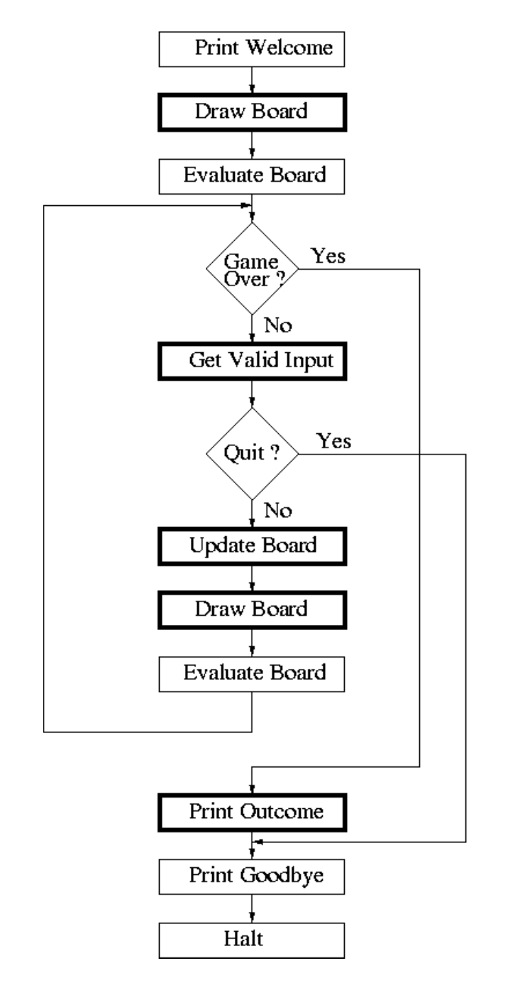

# Tic Tac Toe
```
XXXXXXXXXXXXXX                      
    XX    XX   XXXXX                
    XX        XX                    
    XX    XX  XX                    
    XX    XX  XX            XX        
    XX    XX   XXXXXXXXXXXXXX 

    OOOOOOOOOOOOOO                      
        OO    OOOOO       OOOOO          
        OO   OO    OO   OOO   OOO        
        OO  OO     OO  OOO               
        OO   OO    OO   OOO         OO   
        OO    OOOOO  OO  OOOOOOOOOOOO    

        CCCCCCCCCCCCCC                      
            CC    CCCCCC      CCCCC           
            CC   CC    CC   CCC   CCC         
            CC  CC      CC CCCCCCCCCC         
            CC   CC    CC   CCC            CC 
            CC    CCCCCC     CCCCCCCCCCCCCCC  
```
This program is one designed to allow two users to play the classic game of 
Tic Tac Toe from the command line. 

## How to Play

The game of Tic Tac Toe consists of a 3-by-3 grid, two players, and two sets
of tokens, one set for each player (typically 'X's, and 'O's). The players take
turns placing one of their assigned tokens in an unoccupied cell (in the grid)
of their choice. The first player to place 3 of their tokens in a row 
(vertically, horizontally, or diagonally) wins the game. If the grid fills up 
before either player can place 3 in a row, the game is tied, and is called a 
```cat game```.

The grid is displayed to the console via ASCII characters. Each cell is labeled
by a coordinate between 1 and 9. The console prompts the user to enter the 
coordinate of a cell in which they would like to place their token, and the
grid is updated. The winner is then announced when either player wins the game,
or announces a 'cat game' if the game is a tie.

If the user would like to quit the game, they may enter a lowercase `q` when 
prompted for their next move. This will quit the game.

## Rules

- Each token must be placed in a single cell on a grid, defined by a coordinate
  1-9.
- A token may not be placed on a cell occupied by another token.
- Any input outside the set of single integers between `1` and `9` will cause an
error, and will prompt the user again.
- The user may also enter a lowercase `q` to end the game.

## Interface

Below is the initial grid shown at the beginning of each game. Each number
represents the coordinate assigned to that cell in the grid.

================================================================================
```
⌜-----------------⌝
|     |     |     |
|  1  |  2  |  3  |
|     |     |     |
|-----------------|
|     |     |     |
|  4  |  5  |  6  |
|     |     |     |
|-----------------|
|     |     |     |
|  7  |  8  |  9  |
|     |     |     |
⌞-----------------⌟

X - Which square? [1-9] : 
```
================================================================================

The player who's turn it is, is represented at the beginning of the prompt by
an `X` or `O` (in this case, it is player `X`s turn).

If player 'X' were to enter a `5` to the console when prompted, the board would
be updated, and an 'X' would appear in cell 5. Player 'O' would then be prompted
for his turn.

================================================================================
```
⌜-----------------⌝
|     |     |     |
|  1  |  2  |  3  |
|     |     |     |
|-----------------|
|     |     |     |
|  4  |  X  |  6  |
|     |     |     |
|-----------------|
|     |     |     |
|  7  |  8  |  9  |
|     |     |     |
⌞-----------------⌟

O - Which square? [1-9] : 
```
================================================================================

The following sequence would result in the following board, and messages:
`X:1, 
O:4, 
X:5, 
O:6, 
X:9 `

================================================================================
```
⌜-----------------⌝
|     |     |     |
|  X  |  2  |  3  |
|     |     |     |
|-----------------|
|     |     |     |
|  O  |  X  |  O  |
|     |     |     |
|-----------------|
|     |     |     |
|  7  |  8  |  X  |
|     |     |     |
⌞-----------------⌟


X wins!

Thanks for playing! Goodbye!
```
================================================================================

## Code 

Refer to the source code in `TicTacToe.c` for any inquiries about the code. 

The program follows the following architecture:


